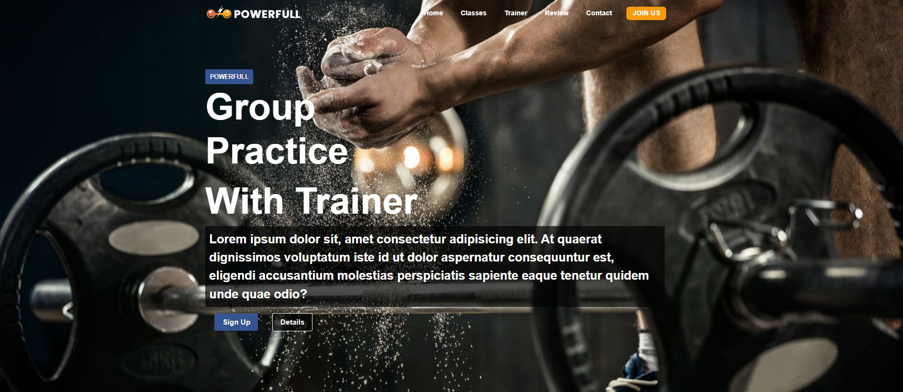

# Sport Center

## About the Project
The **Sport Center** is a responsive and interactive web page project created for a task included in Patika+ Front-End Web Development Bootcamp. The web page as a whole represents an introduction the features and capabilites of the gym.

## Showcase
[Click here to see it live](https://glittery-brioche-71271d.netlify.app/)

## Built With  
- **HTML5** – Structure  
- **CSS3** – Styling and layout  
- **JavaScript** – Dynamic functionality and interactivity  

### Prerequisites  
- Web browser (Chrome, Firefox, Edge, etc.)  
- Code editor (VS Code, Sublime Text, etc.)  

## Screenshot

